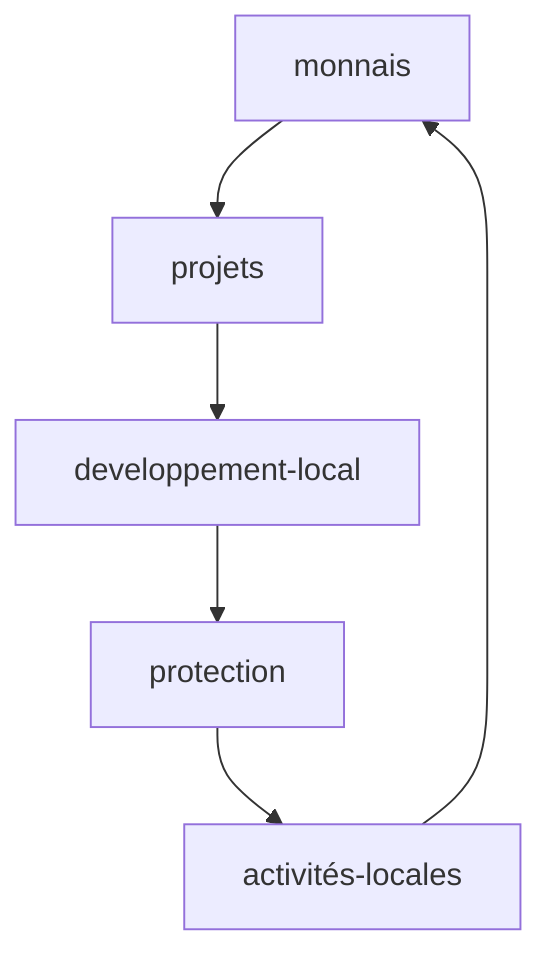

<!-- username 
<h2 align="center"> ✨  ✨ </h2>
-->

<!-- frise -->

<h1 align="center">      </h1>
 
<!-- Intro phrase HI !--> 
 
<h1 align="center">&#9568;&#9571; &#9553; &#8252;   
Je suis un développeur français passionné, bienvenue !</h1>

<!-- presentation -->

  
🔭 Je travaille actuellement en **indépendant.**

🌱 J'apprends actuellement **l'écosystem Ethereum.**

👨‍💻 Tous mes projets sont disponibles sur [https://github.com/franckdun](https://github.com/franckdun)
<!-- 💬 Interrogez-moi sur **"le future à venir".** -->
📫 Me joindre: **scorven7@gmail.com**
  

 
<!--- Social network -->

<h4 align="center">Connectez-vous avec moi sur :</h4>

<!-- Icone codepen -->

 

 

<!-- Technos -->

<!-- <h2 align="center">🛠 Languages and Tools 🛠</h2> -->

   

  
<h1 align="center"> 
  
                
  
</h1>
 

 
   

<!-- github coupes sombre-->

  <a href="https://github.com/ryo-ma/github-profile-trophy"></a > 

<!-- github coupes blanches-->
<!-- 
 <a href="https:/ /github.com/ryo-ma/github-profile-trophy"></a > 
 -->

-------------------------------------------------------------------------------------------------	

<!-- Projects 
<h2 align="center"> My latest projects </h2>

  <table>
        <tr>
            <td width="50%">
                <h3 align="center">My Blog 📰</h3>
                

                    
                    

                        This is my own blog where I share my knowledges
                    

            	

            </td>
            <td width="50%">
                <h3 align="center">Chillflix 🎶</h3>
                

                    
                    

                        A chill radio from youtube to listen Lo-Fi music without being disturbed
                    

            	

            </td>
        </tr>
        <tr>
            <td width="50%">
                <h3 align="center">CCbox TV 📹</h3>
                

                    
                    

                        A netflix like for the Youtube Channel Cacabox TV
                    

                

            </td>
            <td width="50%">
                <h3 align="center">Unbox JS 📦</h3>
                

                    
                    
                    

                        NPM repository created with a friend to help web developper
                    

            	

            </td>
        </tr>
        <tr>
            <td width="50%" align="center">
                <h3 align="center">Underrated skill in javascript 📚</h3>
                

                    
                    

                        This book is for all javascript developers that want to learn unpopular things about javascript
                    

                

            </td>
            <td width="100%" align="center">
                <h3 align="center">Others ...</h3>
                

                

                    

                        <a href="https://marketplace.visualstudio.com/items?itemName=code-oz.what-is-operator-javascript" target="_blank" rel="noreferrer">What is operator javascript 🔌 </a>
                        

                            I created an operator lookup plugin for all VSCode user!
                        

                    

                

                

                    

                        <a href="https://github.com/Code-Oz/youtube-dl-front" target="_blank" rel="noopener" > YT Downloader 🛠</a>
                        

                            I created a youtube downloader that manage video & playlist
                        

                    

                

                

                    

                        <a href="https://chrome.google.com/webstore/detail/beta-twitch-plus/ahdoacgdgcgkhmajnmibefppffbbkgnl?hl=fr&authuser=0" target="_blank" rel="noopener"> Twitch plus 🤖</a> 
                        

                            Chrome extension that improve your experience on twitch
                        

                    

                

                

                    

                        <a href="https://www.npmjs.com/package/liftp-js" target="_blank" rel="noopener"> liftP JS 📦</a> 
                        

                            NPM Package to modify a sync function into an async function without manage parameters
                        

                    

                

                

                
  
            </td>
        </tr>
  </table>

-->

<!-- 👯 Je cherche à collaborer **pour sauver le monde.** -->

🤝 Je recherche de l'aide pour **un projet blockchain.**
 
 ## Monnais locales sous blockchain :

    <a href="scorven7@gmail.com">SEND EMAIL</a>
    

    

  

<!-- nombre de vue -->

  

