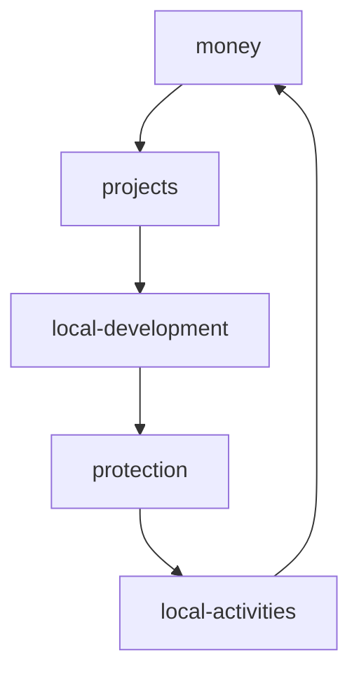

<!-- frise -->
<h1 align="center">      </h1>
 
<!-- Intro phrase HI !--> 
 
<h1 align="center"><a href="https://franckdun.github.io/002_Anim-texte-js/" target="blank" width="76.5px" text-decoration="strong" >&#9568;&#9571; &#9553; &#8252;</a> <br><br>
I am a passionate French developer, welcome ! </h1>


<!-- presentation -->

<div align="center">
  
 I am currently working as a *freelancer.*

 I am currently learning *the Ethereum ecosystem.*

 All my projects are available [here](https://github.com/franckdun?tab=repositories)

 Contact me : *scorven7@gmail.com*
 
 Connect with me on :

<!-- hyperledger -->
<p align="center">
	<a href="#" target="blank"></a>
	&nbsp;&nbsp;
<!-- Icone codepen --> 
	<a href="https://codepen.io/franckdun" target="blank"></a>
	&nbsp;&nbsp;
<!-- Icone mega -->	
	<a href="https://mega.nz/C!wTRmAC4a" target="blank"></a>
<!-- Codecademy -->
	&nbsp;&nbsp;
	<a href="#" target="blank"></a>
<br>
</div>
 
<!-- Technos -->

<!-- <h2 align="center">🛠 Languages and Tools 🛠</h2> -->

<p align="center">
   </p>
  
<h1 align="center"> 
  
  <a href="https://www.w3schools.com/cs/" target="_blank" rel="noreferrer">  </a> <a href="https://git- scm.com/" target="_blank" rel="noreferrer">  </a> <a href="https://developer.mozilla.org/en-US/docs/Web/JavaScript" target="_blank" rel="noreferrer ">  </a> <a href="https:// www.jenkins.io" target="_blank" rel="noreferrer">  </a> <a href="https://mochajs.org" target="_blank" rel="noreferrer">  </a> <a href="https://www.mysql.com/" target="_blank" rel="noreferrer">  </a> <a href="https://nodejs.org" target="_blank" rel="noreferrer">  </a> <a href="https://www.php.net" target="_blank" rel="noreferrer">  </a> <a href="https://www.python.org" target="_blank" rel="noreferrer">  </a> <a href="https://reactjs.org/" target="_blank" rel="noreferrer">  </a> <a href="https://sass-lang.com" target="_blank" rel="noreferrer">  </a> <a href="https://unity.com/" target="_blank" rel="noreferrer">  </a> <a href="https://vuejs.org/" target="_blank" rel= "noreferrer"> </a> <a href="https://www.adobe.com/products/xd.html" target="_blank" rel="noreferrer">  </a> 
  
</h1>
<br>


<p align="center"> 
  
   
</p>

<!-- github coupes stats sombre-->
<p align="center">
  <a href="https://github.com/ryo-ma/github-profile-trophy"></a > </p>

<!-- github coupes blanches-->
<!-- <p align="center"> <a href="https:/ /github.com/ryo-ma/github-profile-trophy"></a > </p> -->

-------------------------------------------------------------------------
### 🔥 Recent GitHub Activity
<!--START_SECTION:activity-->
<!--END_SECTION:activity-->
------------------------------------------------------------------
<!-- Projects --> 

<h2 align="center"> My new project </h2>
<div align="center">
	
  <table>
        <tr>
            <td width="50%">
                <h3 align="center">I am looking for help for a blockchain project.</h3>
                    <p align="center">
                        Local currencies on blockchain. 
                    </p>
                    <!-- envoyer un mail -->
					<p align="center">
						<a href="#">* SEND A EMAIL *</a>
					</p> 
            </td>
            <td width="50%">
                <h3 align="center">General idea</h3>
             <p align="center">
             	Protéger les territoires et la production alimentaire avec des monnais locales.
             	Projet qui rentre dans un cadre ESS et environnemental.
             	<br>
             	Protect territories and food production with local currencies.
              	Project that falls within an SSE and environmental framework.
             </p>
            </td>
        </tr>
  </table>
</div>

<!-- 👯 Je cherche à collaborer **pour sauver le monde.** -->

 ## Local currencies on blockchain : shemas général

<!-- shemas --> 


```javascript
const franckdun = new Project_Blockchain();
function saveTheWorld() {
  if(franckdun.colaborater > 0){
    return console.log("we have no more oil but we have ideas");
  }
 return console.log("Sorry, i can do nothing.");
}
```
<!-- reseaux sociaux -->
[](www.mewe.com/i/franckdunoye#gh-light-mode-only)
[](www.mewe.com/i/franckdunoye#gh-dark-mode-only)
&nbsp;&nbsp;
[](www.mewe.com/i/franckdunoye#gh-light-mode-only)
[](www.mewe.com/i/franckdunoye#gh-dark-mode-only)
&nbsp;&nbsp;
[](https://go.mikecodeur.com/youtube#gh-light-mode-only)
[](www.mewe.com/i/franckdunoye#gh-dark-mode-only)
&nbsp;&nbsp;
[](www.mewe.com/i/franckdunoye#gh-light-mode-only)
[](www.mewe.com/i/franckdunoye#gh-dark-mode-only)
&nbsp;&nbsp;
[](www.mewe.com/i/franckdunoye#gh-light-mode-only)
[](www.mewe.com/i/franckdunoye#gh-dark-mode-only)


<!-- nombre de vue -->

<p align="right">  </p>


